# 📷 Smart Night Vision Security System

<p align="center">
  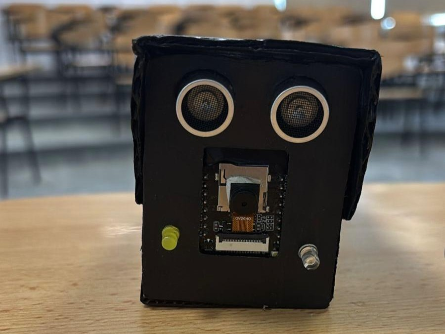
</p>

<p align="center">


</p>

## 📖 Overview

The Smart Night Vision Security System is an embedded surveillance solution that combines ESP32-CAM and Arduino UNO to provide real-time Wi-Fi video streaming, automatic infrared night vision, and intrusion detection.

Using a **Light Dependent Resistor (LDR)**, the system continuously detects ambient light intensity and automatically switches between normal operation and infrared night vision mode. In dark environments, **IR LEDs** illuminate the scene with infrared light, allowing the ESP32-CAM to capture clear video without visible lighting.

To enhance security, an **HC-SR04 Ultrasonic Sensor** detects nearby objects or intruders. When someone approaches the system within a predefined distance, a **buzzer** is activated to provide an audible warning.

The project demonstrates the integration of embedded systems, wireless communication, sensor-based automation, and computer vision into a practical smart surveillance solution suitable for home security, monitoring, and educational applications.

---

## ✨ Features

- 📡 Real-time Wi-Fi video streaming using ESP32-CAM.
- 🌙 Automatic day and night mode switching.
- 💡 Ambient light detection using an LDR sensor.
- 🔴 Infrared illumination for low-light imaging.
- 📏 Ultrasonic obstacle and intruder detection.
- 🔔 Audible alert using a buzzer.
- ⚡ Modular architecture using ESP32-CAM and Arduino UNO.
- 📦 Portable prototype enclosed in a surveillance camera housing.

---

## 🏗️ System Architecture

```text
                 +----------------------+
                 |      ESP32-CAM       |
                 |  Wi-Fi Video Stream  |
                 +----------+-----------+
                            |
                     Live Video Feed
                            |
                            v
                      Laptop / Browser


 +------------------------------------------------------+

                 Arduino UNO Controller

 +------------------------------------------------------+
        |                 |                  |
        |                 |                  |
       LDR          Ultrasonic Sensor      Buzzer
        |
        |
   Day / Night Detection
        |
   -------------------------
   |                       |
Bright                  Darkness
   |                       |
Yellow LED             IR LEDs
```

---

## 📷 Prototype & Implementation

### Side View

<p align="center">
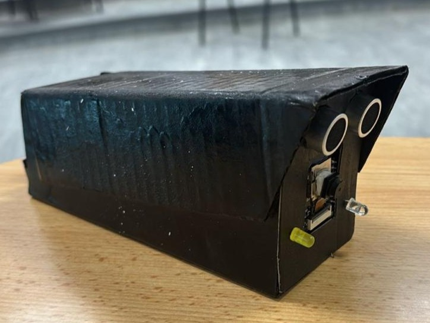
</p>

### Hardware Implementation

<p align="center">
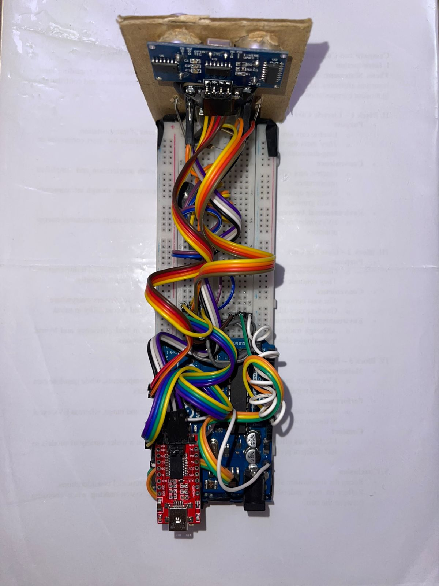
</p>
---
## 🔩 Hardware Components

| Component | Purpose |
|----------|---------|
| ESP32-CAM (AI Thinker) | Captures and streams live video over Wi-Fi |
| Arduino UNO | Processes sensor data and controls the system logic |
| FTDI Programmer | Uploads firmware to the ESP32-CAM |
| LDR (KY-018) | Detects ambient light intensity |
| IR LEDs | Provides invisible infrared illumination in darkness |
| Yellow LED | Indicates daylight operation |
| HC-SR04 Ultrasonic Sensor | Detects nearby objects and intruders |
| Buzzer | Generates an audible alert |
| Breadboard | Circuit prototyping |
| Jumper Wires | Hardware connections |

---

## 🧩 Hardware Components

<p align="center">

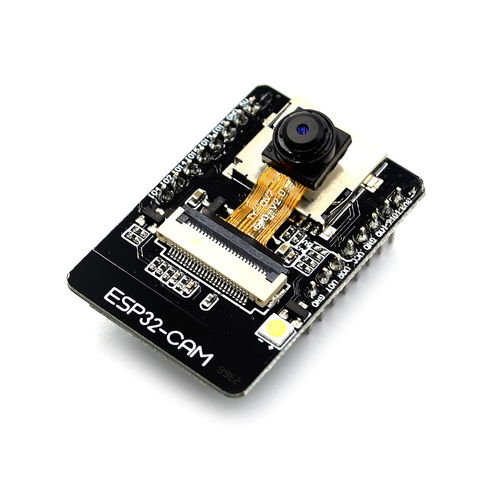
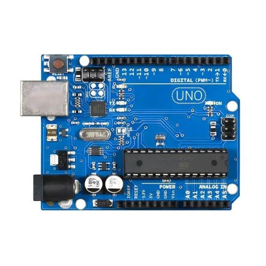
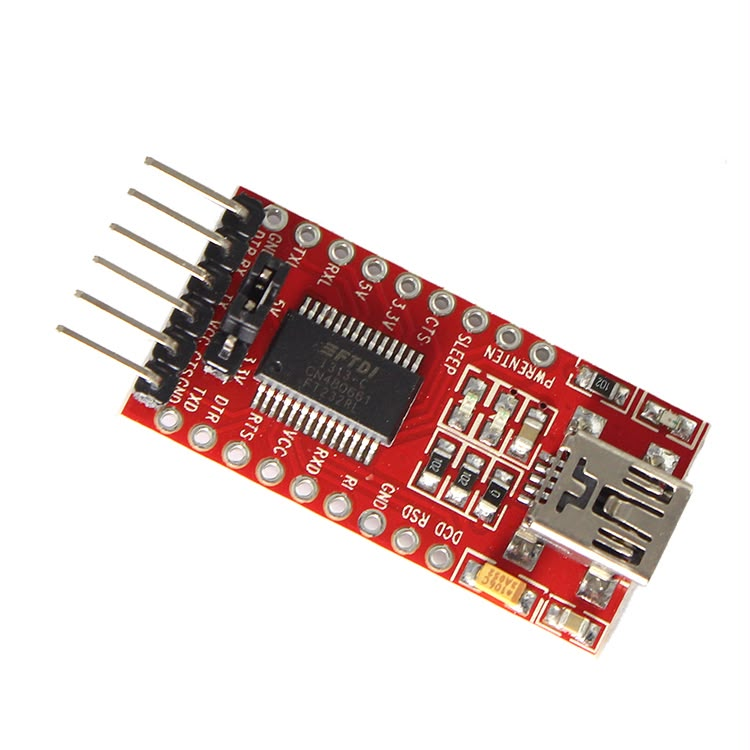
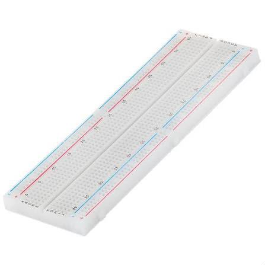
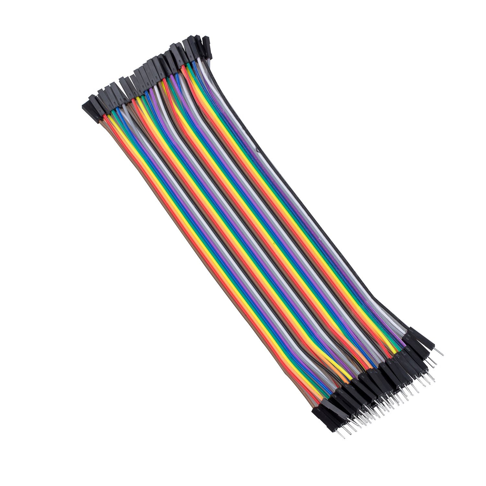

</p>

<p align="center">

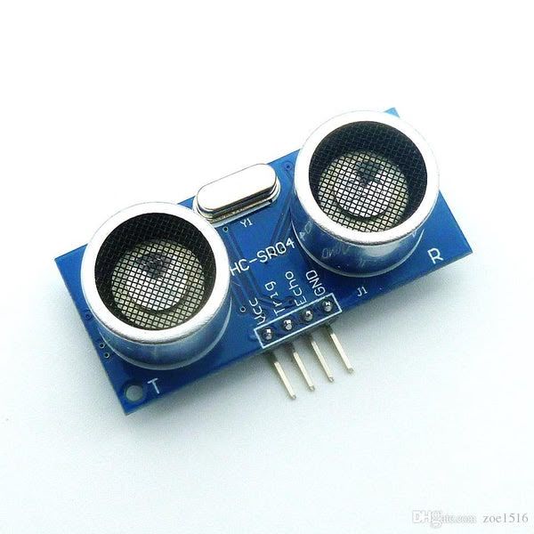
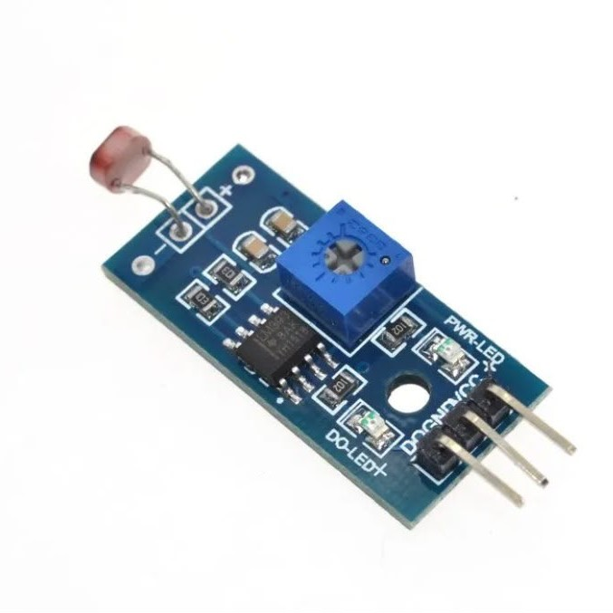
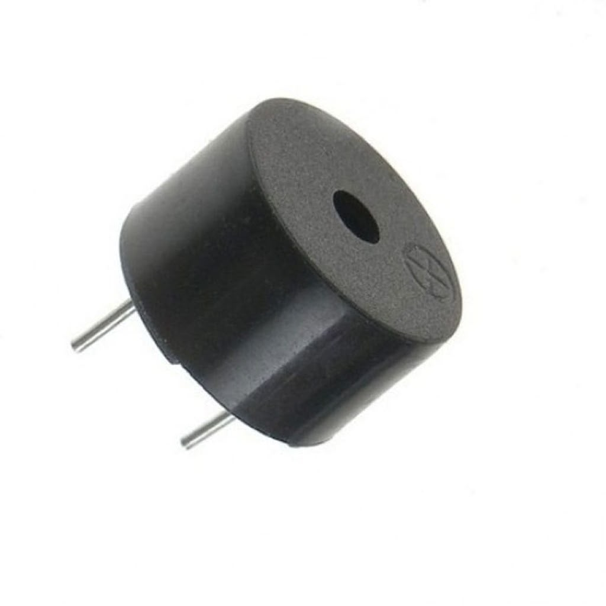
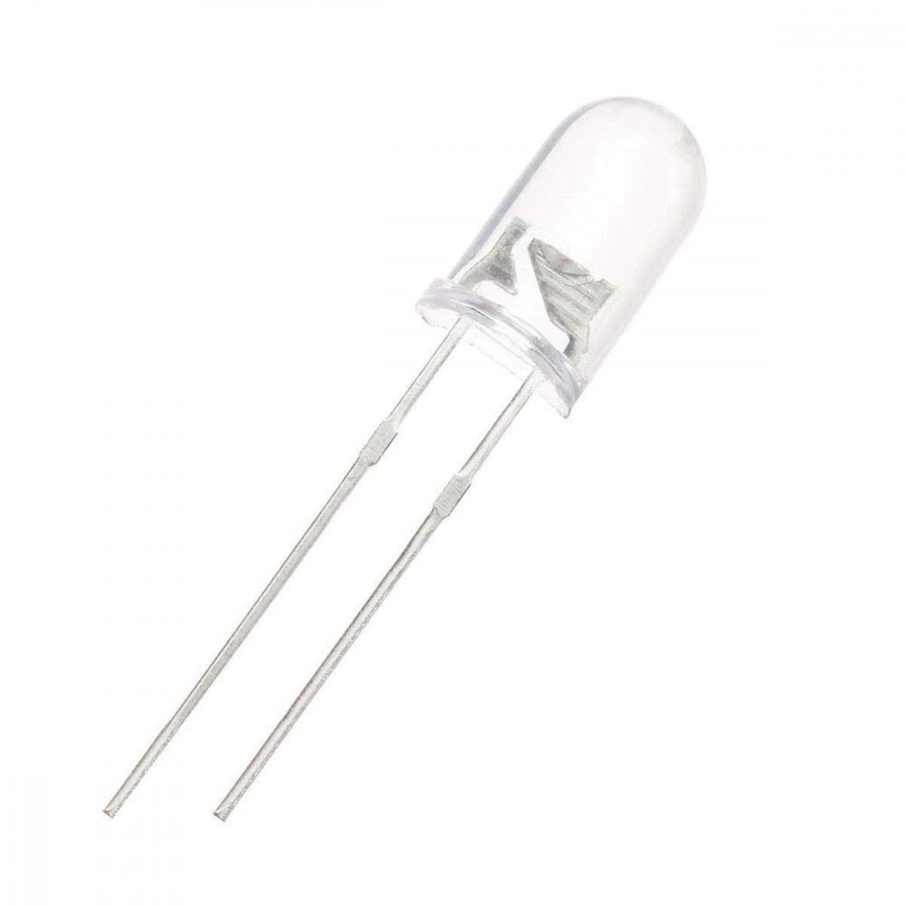
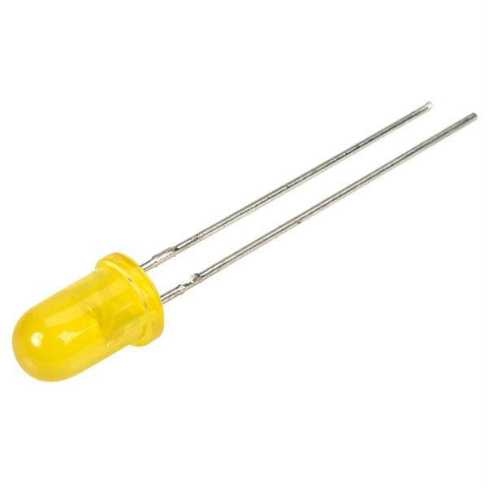

</p>

---

## 🔌 Hardware Connections

### ESP32-CAM Programming Connections

<p align="center">
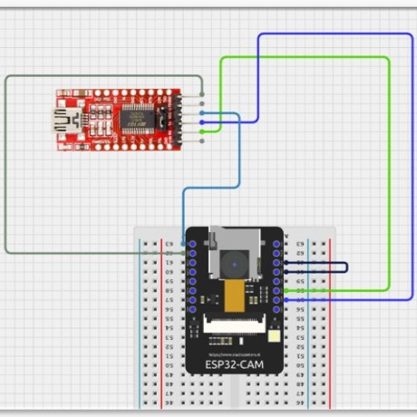
</p>

| FTDI Programmer | ESP32-CAM |
|---------------|-----------|
| VCC | 5V |
| GND | GND |
| TX | U0R |
| RX | U0T |

---

### Arduino UNO Configuration

<p align="center">
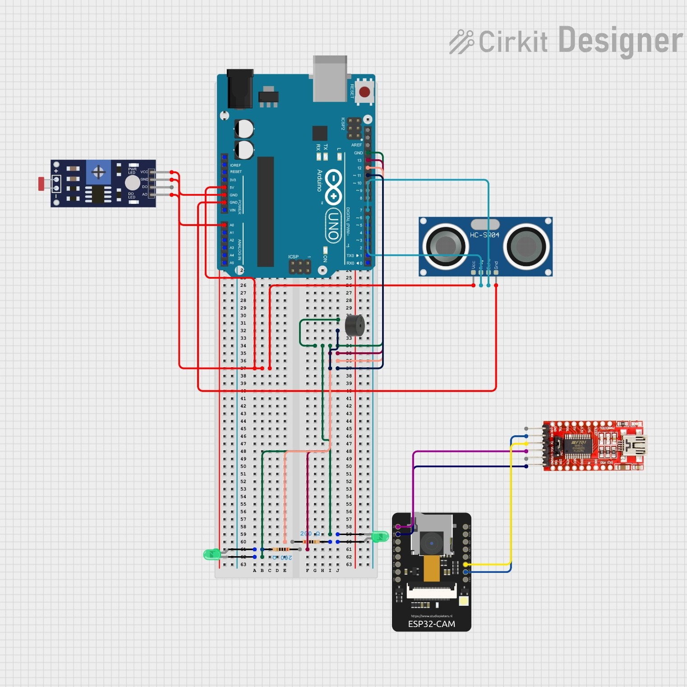
</p>

| Component | Arduino Pin |
|-----------|-------------|
| LDR (Analog Output) | A0 |
| Ultrasonic Trigger | D6 |
| Ultrasonic Echo | D7 |
| Buzzer | D11 |
| Yellow LED | D12 |
| IR LEDs | D13 |

---

## ⚙️ Software & Development Tools

The project was developed using the following software tools:

- Arduino IDE
- ESP32 Board Package
- AI Thinker ESP32-CAM Board Configuration
- FTDI Programmer
- Wi-Fi Network for Video Streaming

---

## ⚡ System Workflow

1. The ESP32-CAM connects to the local Wi-Fi network.
2. A live video stream becomes available through the generated IP address.
3. The Arduino UNO continuously reads the LDR sensor.
4. In bright conditions, the Yellow LED is activated.
5. In dark environments, the IR LEDs automatically turn on.
6. The ESP32-CAM captures clear infrared images using the emitted IR light.
7. The HC-SR04 continuously measures the distance to nearby objects.
8. When an object is detected within the predefined threshold, the buzzer is activated.
9. The monitoring process continues in real time without interrupting the video stream.

---
## 🚀 Getting Started

### Requirements

- Arduino IDE
- ESP32 Board Package
- FTDI Programmer
- USB Cable
- Wi-Fi Network

### Installation

1. Upload the ESP32-CAM code using the FTDI programmer.
2. Upload the Arduino UNO code using the Arduino IDE.
3. Connect both boards according to the hardware configuration.
4. Power both boards via USB.
5. Connect the ESP32-CAM to your Wi-Fi network.
6. Open the generated IP address in your web browser to access the live video stream.

---

## 📂 Repository Structure

```text
Smart-Night-Vision-Security-System
│
├── Code
│   ├── Arduino_UNO
│   └── ESP32_CAM
│
├── Images
│
├── Report
│
├── Demo
│
├── README.md
└── LICENSE
```

---

## 🎥 See It In Action

> **The best way to understand this project is to watch it in action.**

<p align="center">

<a href="https://drive.google.com/file/d/1QWNsHMVMKlsMXha5S5TfuX80A3XprhVR/view?usp=drive_link">


</a>

</p>

<p align="center">

Real-time Streaming • Night Vision • Intrusion Detection • Sensor Automation

</p>

---

## 📄 Project Report

The complete technical report, including system design, implementation, testing, and future work, is available in the **Report** folder.

---

## 🚀 Future Improvements

- 📱 Develop a mobile application for remote monitoring.
- ☁️ Integrate cloud storage for recorded footage.
- 🔋 Replace USB power with a rechargeable battery system.
- 🎯 Implement AI-based motion and human detection.
- 🌧️ Design a weatherproof enclosure for outdoor deployment.
- 📶 Improve Wi-Fi range and signal stability.
- 💾 Record captured images and videos on an SD card.

---

## 👨‍💻 Authors

This project was developed by:

- Ahmed Samir
- Abdelrahman Maher
- Anas Mohamed
- Andrew Ashraf
- Fatima Mahmoud
- Nour Khaled

Faculty of Engineering and Applied Sciences  
Nile University

---

## ⭐ Acknowledgment

This project was completed as part of the **PHY112** course at **Nile University**. It demonstrates the practical integration of embedded systems, wireless communication, sensor-based automation, and infrared imaging into a functional smart surveillance system.

---

## 📜 License

This project is released under the **MIT License**.

Feel free to use, modify, and build upon this work for educational purposes.

---

<div align="center">

### ⭐ If you found this project useful, consider giving it a star!

</div>
